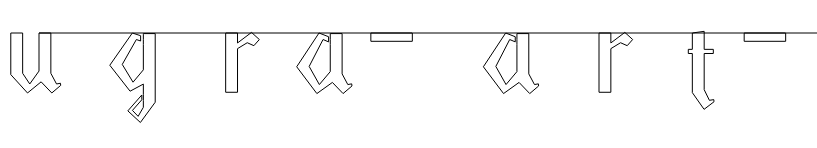

# Он так видит: Write-up

Открываем ссылку, видим линию странной формы, медленно рисующуюся и уходящую куда-то вверх. Если долго вглядываться, в контурах линий начнут угадываться буквы _ugra_ — значит, линия должна рисовать текст, но что-то идёт не так.

Просмотрим исходный код страницы. Он не подразумевает загрузку каких-либо других ресурсов, поэтому страницу можно сохранить в файл, редактировать его и смотреть, что получается.

Видим огромный блок с данными — числами, идущими парами. Они очень похожи на координаты, только бросается в глаза, что они в основном не превышают по модулю 10. Изучив код дальше, понимаем, что это относительные координаты перемещения: к переменным `px` и `py` прибавляется приращение. Правда, оно зачем-то округляется до целого — при таких небольших числах ошибка может быть существенной.

Уберём из кода округление (удалим два раза текст `Math.floor`), а заодно исправим интервал между сегментами с `50` на `5` миллисекунд, чтобы рисовка шла быстрее. Линия станет выписывать буквы:

Явно уходит за границу экрана. Чуть уменьшим множитель приращения — поставим, например, `3` вместо `7` — и увеличим ширину холста с `1280`, допустим, до `5000`.

Осталось аккуратно выписать флаг. Понятно, что начало — `ugra_art_`; конец в данном примере — `_great_151e3d2da48e`. Буквы же из середины флага понятны не все, хотя по большей части они однозначно узнаваемы.

Заметим, что одинаковые буквы повторяются в точности.

А значит, вот эти закорючки в конце больше всего похожи на `lqi` (возможны и другие предположения, но среди остальных символов вокруг не наблюдается ни заглавных букв, ни цифр, поэтому наиболее вероятным кажется именно это).

Этот участок можно было бы принять за `june`, но на самом деле это `jvne`, ведь буква `u` выглядит по-другому, в чём можно убедиться, взглянув в начало флага.

Остаётся вот это место.

Букву `i` мы уже видим достаточно уверенно, а вот две буквы дальше могут вызывать вопросы. Если рассматривать строчные буквы, вариантов немного: `b`, `c`, `d`, `f`, `h`, `m`, `o`, `s`, `x`, `y`, `z` (некоторые из них могли быть исключены правой частью флага). Следует вспомнить, как пишут буквы в прописях с латинским алфавитом, которые неуклюже пытается имитировать шрифт художника. В частности, буква `s`:

По аналогичной причине последняя буква сегмента — это именно `o`, а весь этот сегмент читается `is_so`.

Вот мы и разгадали флаг полностью. Ох уж эти люди искусства.

Флаг: **ugra_art_is_so_jvneovpakwnvjtoalqing_great_151e3d2da48e**
