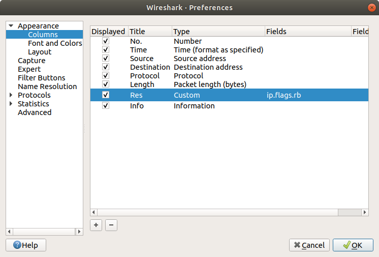
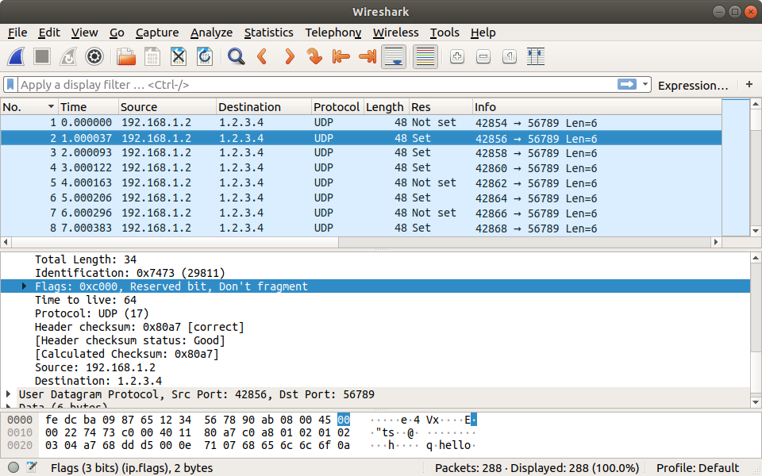

# Пинг: Write-up

Откроем прикрепленный дамп сетевого трафика с помощью утилиты Wireshark. Внутри видим множество UDP-пакетов, отправляемых c 192.168.1.2 на 1.2.3.4:56789. В каждом пакете лишь одно слово `hello`. Сервер не отвечает ни на один из запросов — неясно, связано это с недоступностью сервера или просто с тем, что записывался лишь исходящий трафик, но для решения задачи это знать необязательно.

Между последовательными пакетами проходил интервал примерно в одну секунду, порядковые номера IP-пакетов были последовательными, а исходящие порты выдавались через один. Все эти параметры так и выглядели по умолчанию.

Внимательно изучая несколько случайно выбранных пакетов, обнаруживаем, что в части из них стоит специальный флаг IP-пакета — Reserved Bit. В спецификации IPv4 — [RFC791](https://tools.ietf.org/html/rfc791) — указано, что самый старший флаг зарезервирован и должен быть всегда установлен в 0. А в нашем трафике в некоторых пакетах он равен единице.

Далее существуют различные пути решения. Можно написать скрипт для извлечения битов из трафика, используя, например, Python-библиотеку [scapy](https://scapy.readthedocs.io/en/latest/). Но задание можно решить и без навыков программирования.

Для этого воспользуемся возможностью показа произвольных столбцов в Wireshark — настроим столбец со значением `ip.flags.rb`:

Получаем новый столбец со значениями `Set` и `Not set`. Первые 8 значений этого столбца — `01110101`, что соответствует латинской букве `u`. Значит, мы на верном пути. Далее можно экспортировать таблицу в CSV, а уже её обработать с помощью любого табличного процессора.

 
Если вам более привычен и интересен программный путь решения, то мы подготовили [скрипт для решения задания](solver.py).

Флаг: **ugra_this_bit_is_r5s5rv5d_afa53fe3db**
