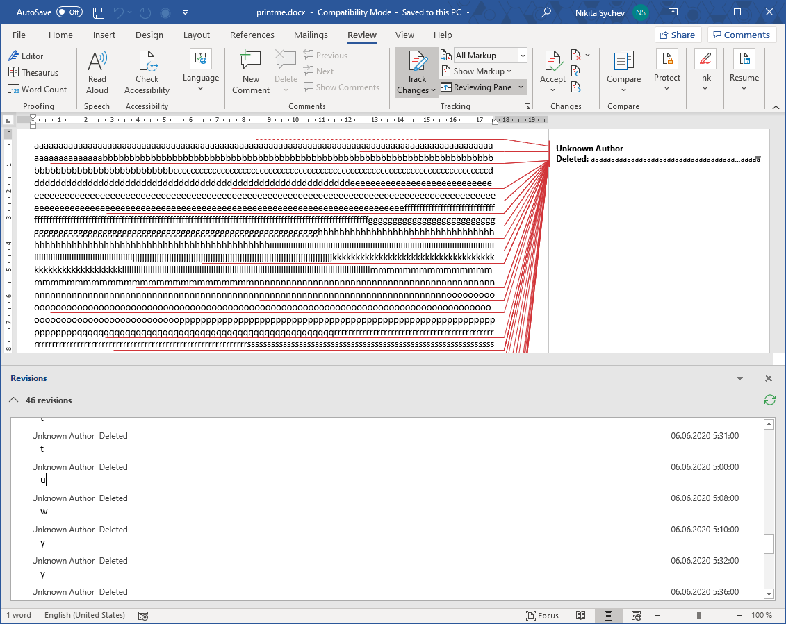
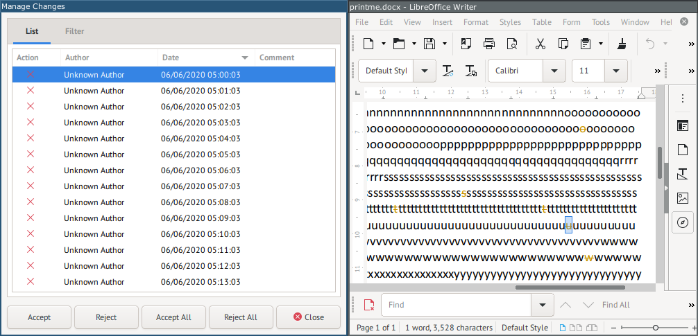

# Напечатай это: Write-up

Откроем документ. Видим, что документ сохранён в режиме _отслеживания изменений_. А если не видим — увидим: в Microsoft Office нажмём _??????_, в LibreOffice — меню _View_ → _Track changes_.

Кто-то редактировал текст, удаляя из него отдельные буквы. Особенно много удалено подчёркиваний. Наверное, из букв, которые попытались удалить, можно как-то собрать флаг.

В Microsoft Office можно _??????_.

В LibreOffice можно открыть перечень изменений (_Edit_ → _Track changes_ → _Manage…_) и отсортировать их по времени, после чего нажимать на каждое изменение и видеть их в тексте. Видим: первое изменение удалило букву `u`, второе — букву `g`, третье — букву `r` и так далее.

Флаг: **ugra_slowly_losing_bits_of_sanity_9c60feead92c**
