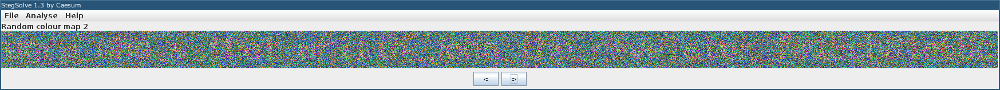
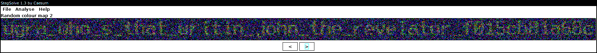

# Камуфляж: Write-up

Как обычно для изображений в заданиях категории stegano, попробуем воспользоваться утилитой stegsolve. Не видим ничего интересного, пока не добираемся до последнего раздела — _Random colour map_. Несмотря на то, что в этом разделе есть страницы 1, 2 и 3, на самом деле новая палитра генерируется каждый раз, и, листая страницы туда-сюда, можно перебрать гораздо больше трёх вариантов палитры.

Рано или поздно начнёт слабо просвечивать что-то похожее на текст:

Подберём удачный вариант, где можно разобрать отдельные буквы. Чтобы упростить себе задачу, откроем изображение в графическом редакторе и подберём настройки контраста и яркости так, чтобы текст легче читался. Ещё легче его будет прочитать, уменьшив изображение: шум при этом размоется, и более крупные детали букв станут видны.

Флаг: **ugra_who_s_that_writin_john_the_revelator_f015cb81a68c**
